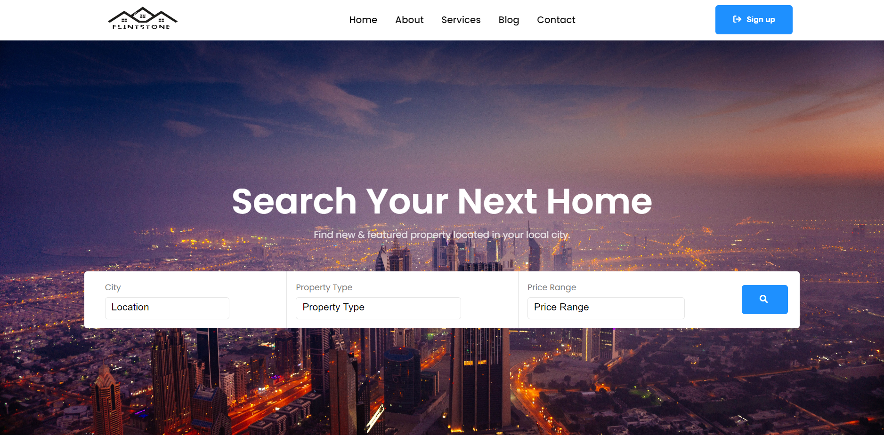

# Real-Estate-Website

## Description of the project

* This Project is a real estate website that can be used to showcase real estate products like apartments, villas, offices, and many more.
* Here is the deployed website: <https://real-estate-website-v1.netlify.app/>

### Application Core

* Data flow: Data is stored as a file along with the components.

### Interface

* Component based interface
* Responsive interface

## Technologies

* HTML5
* CSS3
* JavaScript / ES6
* React

## Third Services

* Font Awesome
