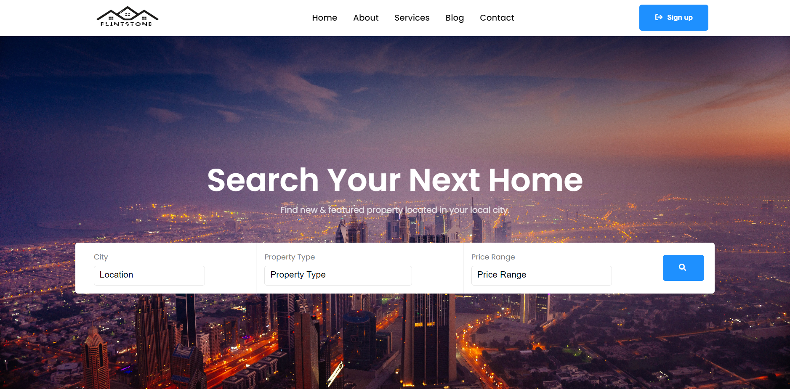

# Real-Estate-Website

## Description of the project

* This Project is a real estate website that can be used to showcase real estate products like apartments, villas, offices, and many more.
* Here is the deployed website: https://real-estate-website-v1.netlify.app/

## Architecture

### Application Core

* Data flow: Data is stored as a file along with the components.
* No back-end for simplicity.

### Interface

* Component based interface
* Wide screen focused interface
* Styling and theming used

## Technologies and Third Services

* HTML
* CSS
* JavaScript
* React, webpack, Font Awesome, ESLint
